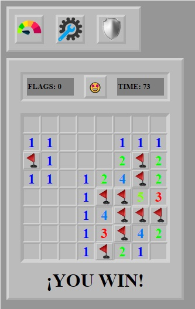
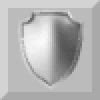

# Minesweeper

This project is my version of the typical minesweeper game.
I created this game to demonstrate my knowledge of the language and the handling of the tools.

## Built with 🛠️
This project was created with: 

## About the project 📖
This project is not totally responsive due to its mandatory resizing, but you can open this game in PC or in touch devices.

## how does it work 💣
When the project is loaded, you will have something like this:

At the top, we will have the game configuration buttons.

- The first button is used to change the difficulty of the game to one of the six default levels.

- The second button is used to configure a personalized board, being able to modify its size and the number of mines. 

- The third button changes from random mode to safe mode, and changes its image to indicate the current mode.

 

You can put a flag, pressing right click (on touch devices, holding the pressure for a few seconds).

In this area, you can find information about the elapsed time and the number of flags remaining.

If you press the emoticon button you can reset the game.